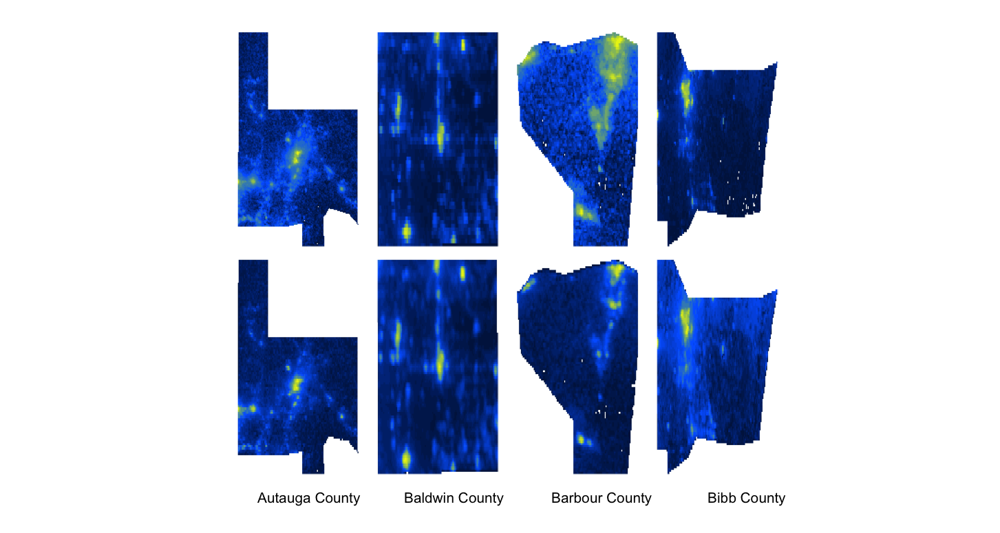
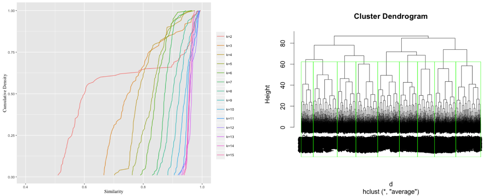
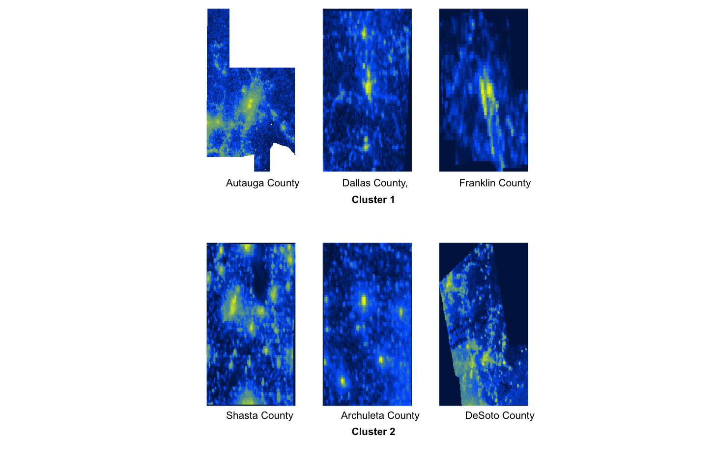

Exploratory Analysis of Nighttime Radiance Patterns and Mental Health
========================================================
__Lei Kang, Lulu Cheng__

__April 24, 2016__

```{r echo=FALSE,message=FALSE,include=FALSE, cache=FALSE}
setwd("/Users/lcheng3/Documents/LLK_Bayes")
load("Data/superlearner_result.RData")
library(randomForest)
```


## Objectives
 - Explore association between nighttime radiance intensity and mental disorder related death
 - Build county-level predictive models for mental disorder related death 

## Data
__Centers for Disease Control and Prevention (CDC)__

 - Get Data from [here](http://wonder.cdc.gov/)
 - Data [Description](http://wonder.cdc.gov/DataSets.html)
 - Variable: Cause of death by county and month in 2014 due to Mental and Behavioral Disorders

__Nighttime VIIRS Day/Night__ (Special thanks to Jeff, Star, Alex)

 - [Raw Image Data](http://ngdc.noaa.gov/eog/viirs/download_monthly.html) for January 2014
 - 2014 County-level Aggregated Radiance [Data](https://github.com/bayesimpact/bayeshack-commerce-satellite/blob/master/analysis/VIIRS_centiles_exploration.ipynb)

__SES Data__

 - Get Data from [here](http://www.ers.usda.gov/data-products/county-level-data-sets/download-data.aspx)
 - County-level monthly poverty, education, employment, population information for 2014


## Exploratory Data Analysis

[Interactive Visualization Dashboard](https://public.tableau.com/profile/publish/RadianceandMentalHelathAnalysis/Dashboard1#!/publish-confirm)

We observe a strong positive correlation between nighttime radiance intensity and mental disorder related death even after controlling for population based on the above Interactive plot.

Now, let's explore a little bit about satellite images. Due to time constraint, we just focus on January, 2014. Then, 3220 county nightlight images are extracted using the following procedure:

1.	Extract pixel information based on county shape file using minimum coverage rectangle
2.	Replace non-county region with 0 (no radiance)
3.	Resample different sizes of images to project onto the median-level reference image (size of 103 * 130) so that all counties are comparable in terms of lighting patterns. See the figure below for before and after comparison after normalization.



4.	Use PCA to construct Eigen-county patterns. The first eigen county map contains a lot of noise because image background is generally dark and not useful though they account for majority pixels. Thus, the first eigen county attemps to pick up noisy information as shown below. However, eigen 2, 3, 4 counties start to represent lighting patterns, see figure below. Need to mention that, we do not rescale every image because we care more about county-wise comparison.


5.	Use PCA to reduce dimension from 103*130 to 8 and perform K-means clustering based on reduced-dimension data. Number of clusters are determined using residual sum of squares reduction, stability-based K-means, and dendrogram together. We end up with K=9 clusters. The idea of stability-based K-means is that if we perturb data a little bit (say by 20% or 40%) and run K-means based on two random subsamples of original data, how much the cluster assignments of two subsamples agree with each other. One can use percentage of matched observations as a metric. Then as this metric moves closer to 1, one tends to get more stable clustering result. We decide to use K=9 because matching metric starts to move insignificantly after K=9 and within sum of squares residuals also start to decay slowly after K=9. Both results are consistent with hierachical clustering dendrogram.

```{r,echo=T,eval=FALSE}

########stability based K-means clustering, decide number of clusters
get_stable<-function(data,k,m){##k is number of clusters, m is sample proportion
  
  size<-m*nrow(data)
  data$id<-1:nrow(data)
  
  ##subsample
  sample1_id<-sample(1:nrow(data), size, replace = FALSE)
  sample2_id<-sample(1:nrow(data), size, replace = FALSE)
  
  sub_1<-data[sample1_id, ]
  sub_2<-data[sample2_id, ]
  
  ##k-means
  result_1<-data.frame(kmeans(sub_1[2:9], centers = k,algorithm= "Lloyd",iter.max = 1000)$cluster) ##try to alleviate the impact of random starting value
  result_2<-data.frame(kmeans(sub_2[2:9], centers = k,algorithm= "Lloyd",iter.max = 1000)$cluster)
  
  ##cluster result
  sub_1_clust<-data.frame(cbind(sub_1$id,result_1))
  names(sub_1_clust)[1] <- "id"
  names(sub_1_clust)[2] <- "cluster"
  sub_2_clust<-data.frame(cbind(sub_2$id,result_2))
  names(sub_2_clust)[1] <- "id"
  names(sub_2_clust)[2] <- "cluster"
  
  ##find intersected obs and its clustering membership, ensure 1-1 match
  intersect<-merge(sub_1_clust,sub_2_clust,by=c("id"))
  clust_1<-as.integer(as.character(intersect$cluster.x))
  clust_2<-as.integer(as.character(intersect$cluster.y))
  
  ##construct C_ij
  inter.dim <- dim(intersect)[1]
  C_1 <- matrix(clust_1, nr = inter.dim, nc = inter.dim) == matrix(clust_1, nr = inter.dim, nc = inter.dim, byrow = TRUE)
  C_2 <- matrix(clust_2, nr = inter.dim, nc = inter.dim) == matrix(clust_2, nr = inter.dim, nc = inter.dim, byrow = TRUE)
  diag(C_1) <- 0
  diag(C_2) <- 0
  
  ##compute similarity measure
  jaccard <- sum(C_1 * C_2)/(sum(C_1) + sum(C_2) - sum(C_1 * C_2))
  matching<- (sum(C_1 * C_2)+sum((1-C_1) * (1-C_2)))/(sum(C_1 * C_2)+sum((1-C_1) * (1-C_2))+sum((1-C_1)*C_2)+sum((1-C_2)*C_1))
  corr<-sum(C_1 * C_2)/sqrt(sum(C_1)*sum(C_2))
  #   print(jaccard)
  #   print(matching)
  #   print(corr)
  return(c(jaccard,matching,corr))
}


stable_result_jac<-matrix(0,nrow=14,ncol=100)
stable_result_mat<-matrix(0,nrow=14,ncol=100)
stable_result_cor<-matrix(0,nrow=14,ncol=100)


##################run stability-based K-means
for (k in 2:15){
  for (i in 1:100){
    dd<-get_stable(withname,k=k,m=0.6)
    stable_result_jac[k-1,i]<-dd[1]
    stable_result_mat[k-1,i]<-dd[2]
    stable_result_cor[k-1,i]<-dd[3]
  }
}

jac<-data.frame(t(stable_result_jac))
mat2<-data.frame(t(stable_result_mat))
cor<-data.frame(t(stable_result_cor))

```


The following figure presents selected raw images from two representative clusters. Cluster 1 tends to be more centered while cluster 2 tends to be more sparsely populated in terms of night time radiance. Both clusters can capture inherent different night time lighting patterns.



## Prediction Models for Death Counts

After exploring satellite image data, we need to provide more useful insight on how it might influence mental disorder related death. To this end, we match county level monthly mental disorder related death data with aggregated county-level radiance data for year 2014. In the end, we got 9754 observations with matched death and nighttime radiance information where 75% of them is treated as a training set and the rest 25% is test set. We are going to predict county-level monthly mental disorder related death counts using the following features:

1. SES: Population, poverty percentage, median income, unemployment rate, domestic migration rate, international migration rate, natural population growth rate, death rate, percentage of adults with less than high school degree, percentage of adults with high school degree, percentage of adults with college degree, percentage of adults with bachelor degree or more
2. Spatial data: lat, lon of county
3. Temporal data: month indicator
4. Lighting data: County-wide sum of monthly average nighttime radiance 

We apply the Super Learner idea (Ensemble learning) which combines outputs from the following 11 algorithms: Ridge, Lasso, Decision tree with pruning, Multivariate adaptive regression splines (MARS), Random forests, generalized additive model, SVM, Neural Network, linear regression, generalized boosting.

5-fold CV is used to tune parameters in aforementioned algorithms and Super Learner seeks the best convex combination of those prediction results.

```{r,echo=T,eval=F}
library(SuperLearner)
set.seed(1127)
index<-sample(seq_len(nrow(new)),size=floor(0.75*nrow(new)))
train<-new[index,]
test<-new[-index,]
SL.library<-c('SL.ridge','SL.rpartPrune','SL.polymars','SL.mean','SL.randomForest','SL.gam','SL.glm','SL.glmnet','SL.svm','SL.gbm','SL.nnet')

X<-train[c("month","pop","per_povall","median_income","ump_rate","R_DOMESTIC_MIG_2014",
           "R_INTERNATIONAL_MIG_2014","R_NATURAL_INC_2014","R_death_2014","per_bechelor",
           "per_college","per_highsch","per_lesshighsch","sum","lat","lng")]   

SL.out<-SuperLearner(Y=train$Deaths,X=X,SL.library = SL.library,family = 'gaussian',cvControl = list(V=5))

testX<-test[c("month","pop","per_povall","median_income","ump_rate","R_DOMESTIC_MIG_2014",
           "R_INTERNATIONAL_MIG_2014","R_NATURAL_INC_2014","R_death_2014","per_bechelor",
           "per_college","per_highsch","per_lesshighsch","sum","lat","lng")]   
pred<-predict.SuperLearner(SL.out,newdata=testX,onlySL = TRUE)
```

Random forests are found to have the best performance, followed by MARS and SVM. Thus, in the final Super Learner prediction, the weights of random forests output is very hight which is about 0.96. Other algorithms are not doing a good job in this dataset hence their weights are estimated to be 0. The following plots show the prediction performance on test set. The plot suggests that our prediction values are in line with true values.

```{r fig.width=10, fig.height=5,echo=T}
SL.out

sqrt(mean((pred$pred-test$Deaths)^2)) ##RMSE

plot(pred$pred,test$Deaths,xlim=c(0,600),ylim=c(0,600))

cor(pred$pred,test$Deaths)
```

## Conclusions
To gain more insight about the importance of night time radiance in mental-relatd death prediction, we run a seperate random forests model using 1000 trees. See the importance measure below. Following population, aggregated county level monthly average night time radiance is the second most important predictor even after controling for other SES, spatial, and month effects. It gives us a strong indication that night time radiance is a mental health problem. However, assoication is not causation. We need to be careful in interpretating this result. But, the predicative model does suggest night time radiance is a good metric in predicting mental disorder related death and also presumably happiness and well-being.

```{r,echo=T,eval=F}
fit<-randomForest(Deaths~ pop + per_povall+month+
                    median_income+ump_rate+R_DOMESTIC_MIG_2014+
                    R_INTERNATIONAL_MIG_2014+R_NATURAL_INC_2014+
                   R_death_2014+per_bechelor+per_college+
                  per_highsch+per_lesshighsch+sum+lat+lng,
                  data=train,importance=TRUE, ntree=1000)
```

```{r,echo=T,eval=T}
importance(fit)

```

